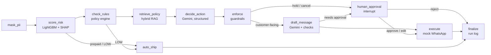

# RTO Guard 🛡️

**AI agent that cuts Return-to-Origin (RTO) losses on cash-on-delivery orders for Indian D2C brands.**

An ML model scores every order's RTO risk and explains why. For risky COD orders, a
LangGraph agent reads the brand's policies (hybrid RAG), picks an intervention with
Gemini (WhatsApp confirmation, prepaid offer, ₹99 partial COD, agent call-back, hold),
passes it through a deterministic guardrail layer, drafts the customer message, and asks
a human before anything costly. Everything is evaluated, traced and shown in a dashboard.

**Live demo:** _add your Streamlit Cloud link_ · **Demo video:** _add link_

📖 **Documentation & Interview Guide:** [Complete Architecture & Interview Masterclass PDF](RTO_Guard_Complete_Guide_and_Interview_Prep.pdf) | [HTML Version](rto_guard_guide.html)

### Highlights
- **~9x more savings than the naive rule** "verify every COD order" on a time-based test set (₹48k vs ₹5k per 20k orders)
- **LLM proposes, rules enforce:** offer caps, repeat-RTO rules and cancellations can never be violated, and evals measure how often the LLM needed correcting
- **Human-in-the-loop that survives restarts:** LangGraph `interrupt()` + Postgres checkpointer
- **Zero PII to the LLM**, proven by a test
- **Evals as CI gates:** retrieval, agent decisions, LLM-as-judge message quality
- **Langfuse tracing** with per-order token cost

**Stack:** Python · LightGBM · MLflow · Gemini (LLM + embeddings) · LangGraph · Postgres/pgvector (Supabase) · Langfuse · Streamlit · GitHub Actions

## Quickstart

```bash
cp .env.example .env
make install
make up        # Postgres + pgvector
make data      # generate 100k semi-synthetic orders
make load      # load into Postgres
make train     # train model, log to MLflow, save ml/artifacts/
make predict   # score a demo order
make mlflow    # open MLflow UI
make ingest    # chunk + embed policy docs into pgvector
make search q="token advance for partial COD"
make eval-rag  # keyword vs vector vs hybrid retrieval eval
make agent order=ORD0085506   # run the agent on one order (asks for approval)
make agent-demo               # 5 random recent COD orders, auto-approve
make eval                     # retrieval + agent evals (fails on quality-gate regressions)
make dashboard                # Streamlit dashboard
make test
```

## Using Supabase instead of local Docker

1. Create a free Supabase project (pick the Mumbai region).
2. Project Settings → Database → Connection string → **URI, Session pooler**.
3. Put it in `.env` as `DATABASE_URL=...` (it overrides the local `POSTGRES_*` values).
4. Run `psql "$DATABASE_URL" -f db/init.sql` once, then `make load` and `make ingest`.

pgvector is built into Supabase; `init.sql` and `make ingest` enable it automatically.

## Data

Orders are **semi-synthetic**: generated from a hidden logistic model built on
known Indian RTO drivers (COD, city tier, address quality, first-time buyer,
late-night orders, heavy discounts, category, courier) plus noise. Hidden
drivers (customer propensity, pincode risk) are not exported, so the model
must learn them from observable proxies. Prior-RTO counts use only past orders
to avoid label leakage.

| Segment | RTO rate |
|---|---|
| Overall | ~18% |
| COD | ~27% |
| Prepaid | ~5% |
| Tier 1 / 2 / 3 | ~12% / 19% / 26% |

## ML model

LightGBM on 18 leak-free features (customer history, pincode history, address
quality, COD x order value, timing, discount, category, courier). Split is
**time-based** (70/10/20) because production always predicts the future.

No `scale_pos_weight`: the agent makes cost-based decisions, so probabilities
must stay calibrated. Imbalance is handled by choosing the decision threshold on
the validation set to **maximise net INR savings** (see `ml/economics.py`),
not by accuracy.

Test set (last 20% of orders, 20k):

| Metric | Value |
|---|---|
| ROC-AUC | 0.76 |
| PR-AUC | 0.39 (base rate ~0.18) |
| Recall / Precision @ threshold | 0.64 / 0.33 |
| Orders flagged | 33% |
| Net savings | ₹48k per 20k orders (~₹2.4 per order) |
| Naive "flag every COD" baseline | ₹5k — model is **~9x better** |

Every prediction ships with its top reasons from TreeSHAP, e.g.
"High-value COD order", "Short / incomplete address", which the agent uses to
pick the intervention and write the customer message.

## RAG over policies

18 policy docs in `rag/docs/` for a fictional D2C brand, **Kavya Threads**:
COD verification, prepaid offers, partial COD, holds and cancellations,
escalation matrix, PII rules, festive-sale rules, NDR handling, and courier
contract terms. *Courier terms are illustrative, not real courier policies.*

- **Chunking:** one chunk per `##` section, prefixed with `Doc title > Section`
  so every chunk makes sense on its own. Long sections split on paragraphs with overlap.
- **Embeddings:** Gemini `gemini-embedding-001`, separate task types for documents
  vs queries, truncated to 768 dims (Matryoshka) and re-normalised.
- **Store:** pgvector with an HNSW cosine index + a generated `tsvector` column (GIN).
- **Hybrid search:** vector top-20 and full-text top-20 fused with
  Reciprocal Rank Fusion. Keyword search nails exact terms (`₹99`, `NDR`),
  vectors handle paraphrases ("part payment" → Partial COD).
- **Metadata filters:** the agent can restrict to one courier's terms
  (`applies_to`) plus brand-wide docs.
- **Incremental ingest:** chunk id = content hash, so re-running only embeds
  changed sections and deletes stale ones.
- **Citations:** every result carries `Doc > Section`, passed to the LLM as `[1]`, `[2]`…

Retrieval eval: 24 paraphrased questions with a known correct doc/section
(`evals/retrieval_golden.jsonl`), comparing keyword, vector and hybrid on
Hit@1, Hit@3, section Hit@3 and MRR@5. Run `make eval-rag` with Gemini
embeddings to get the real numbers.

## The agent (LangGraph)



**The LLM proposes, the rules enforce.** Gemini reads the retrieved policies and
picks an action with cited reasoning (structured output, Pydantic-validated).
A deterministic policy engine (`agent/policy.py`) then applies hard limits the
LLM cannot override: offer caps (5% auto / 10% with approval, 50% total
discount), mandatory Partial COD for repeat-RTO customers, agent call-back for
high-value COD, no cancellations without a human.

| Production concern | How it is handled |
|---|---|
| PII | Phone, name and address never reach the LLM. Messages use `{first_name}`, filled locally after generation. A test asserts no PII appears in any prompt. |
| Human-in-the-loop | LangGraph `interrupt()` for offers above 5%, cancellations, guardrail corrections, or LLM failures. |
| Durability | Postgres checkpointer: a pending approval survives restarts and can be resumed later (`--resume`). |
| LLM failure | Retries with backoff, fallback model (`gemini-3.1-flash-lite`), then a safe default action + human review. |
| Bad messages | Banned words, length, required fields checked; one self-correction retry, then a safe template + review. |
| Send window | Messages scheduled only 9 AM–9 PM IST. |
| Cost | Tokens and USD tracked per LLM call and per order in `agent_runs`. |
| Cheap by default | Prepaid and LOW-risk orders never call the LLM. |

WhatsApp is **mocked**: messages land in the `agent_outbox` table and are shown in the dashboard.

Tests (`tests/test_agent.py`, 23 cases) run the full graph with a scripted fake
LLM: excessive offers get clamped, rejected orders send nothing, repeat-RTO
customers are forced to Partial COD, a broken LLM falls back safely, and night
orders are scheduled for 9 AM.

## Evals

Three layers, each run by one command and wired into CI.

**1. ML** (`make train`): ROC-AUC, PR-AUC, and net ₹ savings vs a naive baseline on a time-based test set.

**2. Retrieval** (`make eval-rag`): 24 paraphrased questions, keyword vs vector vs hybrid.

**3. Agent** (`make eval-agent`): 16 golden scenarios in `evals/agent_cases.py`
(repeat-RTO customers, high-value orders, incomplete addresses, festive-sale rules,
discount caps, Hinglish states, prepaid/low-risk skips). The risk band is fixed per
case, so this tests the LLM + policy layer in isolation. It scores the LLM
**before** guardrails and the system **after**:

| Metric | Meaning |
|---|---|
| raw_action_accuracy | LLM chose an action the policy allows |
| raw_offer_compliance | LLM stayed within the discount limit |
| guardrail_interventions | how often rules had to correct the LLM |
| final_compliance | final action allowed or escalated to a human (**gate: 100%**) |
| message_first_pass / fallback_rate | message passed checks first try / needed template |
| llm_skip_correct | prepaid and low-risk orders never called the LLM (**gate: 100%**) |
| judge_warmth / clarity / policy / language_ok | Gemini LLM-as-judge on every message |
| cost / latency | avg USD per LLM-handled order, avg and p95 latency |

The gap between *raw* and *final* numbers is the measured value of the guardrail layer.
CI runs the agent eval with a scripted fake LLM and fails the build if a gate drops.

## Observability (Langfuse)

Add `LANGFUSE_PUBLIC_KEY` / `LANGFUSE_SECRET_KEY` to `.env` (free at cloud.langfuse.com)
and every order becomes one trace: a root `rto-guard-order` span, one child span per
graph node (retriever and guardrail nodes typed as such), and each Gemini call as a
generation with prompt, parsed output, token usage and cost. Node inputs are never
logged because the raw order contains PII; only masked outputs and PII-free prompts
are sent. Without keys, tracing is a no-op.

## Dashboard

`make dashboard` opens five tabs: **Overview** (orders processed, auto-ship rate, estimated
₹ savings, LLM cost in ₹), **Run agent** (sample unseen orders, see risk reasons, cited
policies, guardrail corrections and the node-by-node trace), **Approvals** (approve, edit
or reject paused decisions; the graph resumes from its checkpoint), **WhatsApp outbox**
(mock messages with IST send times) and **Model & evals**.

Without a database or API keys it runs in demo mode (in-memory store, scripted LLM).

## Deploy (Supabase + Streamlit Community Cloud)

1. **Supabase:** create a project (Mumbai region). Copy Project Settings → Database →
   Connection string → **Session pooler** URI (Streamlit Cloud needs IPv4, which the direct
   connection does not provide).
2. **Load data from your laptop** with `DATABASE_URL` set in `.env`:
   ```bash
   psql "$DATABASE_URL" -f db/init.sql
   make data && make load && make ingest
   ```
   The model artifacts in `ml/artifacts/` are committed (≈420 KB), so the cloud app needs no training.
3. **Push to GitHub.**
4. **Streamlit Cloud:** New app → your repo → main file `dashboard/app.py` → Python 3.12.
   Paste `.streamlit/secrets.toml.example` (with real values) into *Secrets*.
   `requirements.txt` and `packages.txt` (for LightGBM's `libgomp1`) are picked up automatically.

## Honest limitations

- Orders are semi-synthetic and policies belong to a fictional brand; the courier terms are illustrative.
- Savings assume a 40% intervention success rate; a real rollout would measure this with an A/B test.
- WhatsApp is mocked; production would use the WhatsApp Business API with approved templates.
